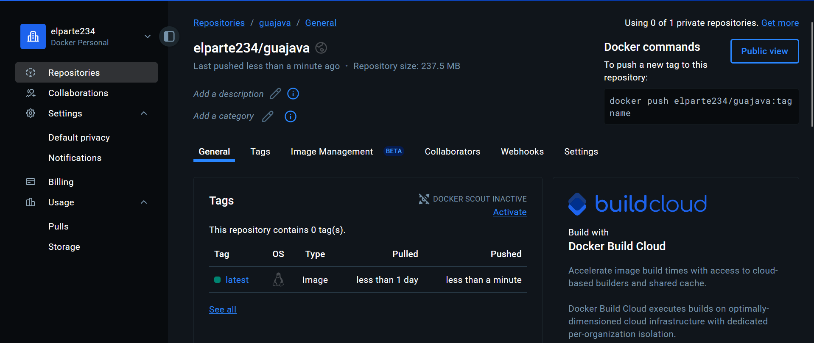
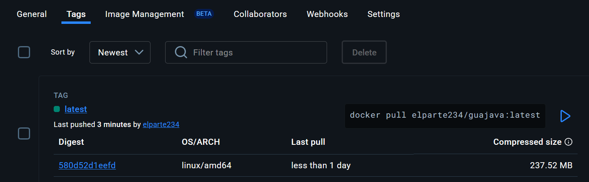
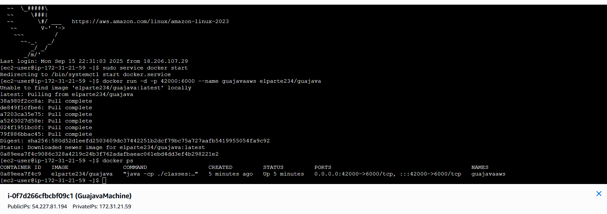
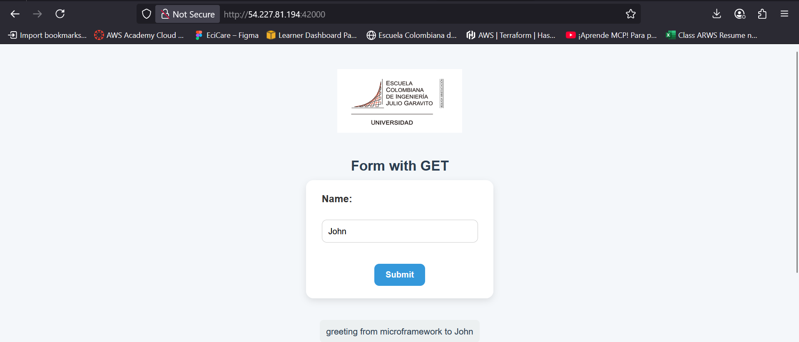
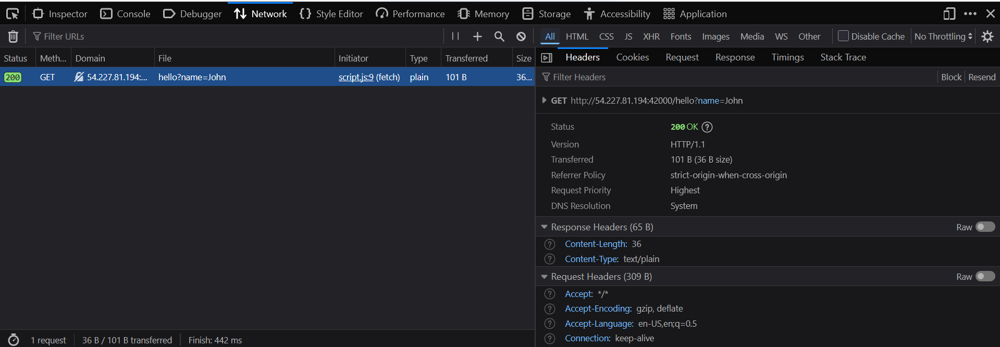
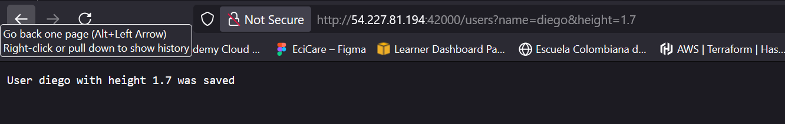

# Java Microframework
This project is an web microframework in Java, inspired by Spring Boot.
It enables the creation of web applications using annotations such as @RestController, @GetMapping, and @RequestParam to define controllers and handle HTTP routes in a simple way.

The framework includes an automatic class scanner that traverses the classpath and registers annotated components, eliminating the need for manual configurations.
It also implements query parameter conversion to different data types (integers, floats, booleans, and strings), making it easier to develop more expressive controllers.

Additionally, the framework is concurrent, allowing multiple requests to be processed simultaneously for improved performance.

## Getting Started
These instructions will help you get a copy of the project running on your local machine for development and testing purposes.

### Prerequisites
You will need the following installed:
- [Java 17+](https://jdk.java.net/)
- [Maven 3.6+](https://maven.apache.org/install.html)
- Git (optional, for cloning)

### Installing
Clone the repository:
```bash
git clone https://github.com/thesrcielos/GuaJava
cd GuaJava
```

Build the project using Maven:
```bash
mvn clean install
```

### Running the Application

#### HTTP Server
Start the HTTP server on port 35000:
```bash
java -cp target/classes org.eci.arep.Main
```
##### Docker
In this project exists a **Dockerfile** to create an image of the application and a **docker-compose** 
to create a container to run the application

Creating an image
````bash
docker build --tag guajava .
````
Creating a container
````bash
docker compose up -d
````
The server will be available at `http://localhost:35000`
## Microframework Annotations

The framework uses its own annotation system to simplify controller definition and HTTP request handling:

- **`@RestController`**  
  Marks a class as a controller that can handle HTTP requests.  
  All routes defined in this class will be automatically available.

- **`@GetMapping("path")`**  
  Associates a controller method with a specific route to handle **GET** requests. This annotation only works in static methods.  
  **Example:**

```java
  @RestController
  public class HomeController {
  
      @GetMapping("/hello")
      public static String hello(@RequestParam(value = "name", defaultValue = "world") String name) {
          return "Greeting from microframework to " + name;
      }
  }
```
- **`@RequestParam("name")`**
  Allows binding query string parameters (?name=...) with controller method parameters.
  It also supports default values:
```java
    @GetMapping("/sum")
    public static String sum(
        @RequestParam(value = "a", defaultValue = "0") int a,
        @RequestParam(value = "b", defaultValue = "0") int b
    ) {
    return "Sum = " + (a + b);
    }
```

## Component Scanner

The framework includes a component scanner that automatically searches for all classes within the classpath annotated with @RestController.
This way, it's not necessary to manually register controllers:

```java
public static void loadComponents(String[] args) {
    try {
        List<Class<?>> classes = ComponentScanner.scanForControllers("org.eci.arep");
        for (Class<?> cl : classes) {
            loadComponent(cl);
        }
    } catch (ClassNotFoundException | IOException ex) {
        ex.printStackTrace();
    }
}
```

### What does the *ComponentScanner* do?
* Traverses the project's root directory (src/main/java).
* Identifies all classes annotated with @RestController.
* Registers their methods annotated with @GetMapping in an internal map (services).
* Allows the framework to find and execute the corresponding method dynamically when an HTTP request arrives.
#### Usage and response Example of Microframework

Go to the browser and type http://localhost:35000/hello?name=your-name

Now try the /users endpoint http://localhost:35000/users?name=your-name&height=1.67


## Usage Examples

### Basic HTTP Request
```bash
curl http://localhost:35000/
```

### Coding Style
The code follows the Google Java Style Guide and was formatted accordingly using Maven Checkstyle plugin.

## Running the tests

Run the automated unit tests with Maven:
```
mvn test
```
Unit Tests

Unit tests are written using JUnit and ensure the logic in **HttpServer** works as expected.
Some of the things that are being tested are:
* Http Server serves static files
* Http Response structure 
* Http Server GET API Endpoints

Example:
This test is testing that the required parameters are valid

```
@Test
    public void testTempEndpoint_withParam() throws Exception {
        HttpRequest request = mock(HttpRequest.class);
        when(request.getUri()).thenReturn(new URI("/temp"));
        when(request.getValues("msg")).thenReturn("Hola");

        Socket socket = mock(Socket.class);
        ByteArrayOutputStream baos = new ByteArrayOutputStream();
        when(socket.getOutputStream()).thenReturn(baos);
        
        HttpServer.handleDynamicRequest(socket, request);

        String responseText = baos.toString();
        
        assertTrue(responseText.contains("Temp says: Hola"));
    }
```

## Deployment
To package the application:
```bash
mvn package
```

Then run the packaged JAR:
```bash
java -jar target/HttpServer-1.0-SNAPSHOT.jar
```

## Evidence Docker Hub and AWS

### Docker image uploaded to Docker Hub



### AWS Deployment
Docker processes


Web Requests



### Video
https://www.youtube.com/watch?v=WBDBXcO-Py4

## Javadoc
Code documentation is available in `target/site/apidocs/index.html` after running:
```bash
mvn javadoc:javadoc
```

## Built With
* [Java 17](https://www.oracle.com/java/technologies/javase/jdk11-archive-downloads.html) - Programming Language
* [Maven](https://maven.apache.org/) - Dependency Management
* [JUnit 5](https://junit.org/junit5/) - Testing Framework
* [Mockito](https://mockito.org/) - Mocking Framework

## Contributing
Please read **CONTRIBUTING.md** for details on our code of conduct and the process for submitting pull requests.

## Authors
* **Diego Armando Macia Diaz** 

## License
This project is licensed under the MIT License – see the [LICENSE.md](LICENSE.md) file for details.
